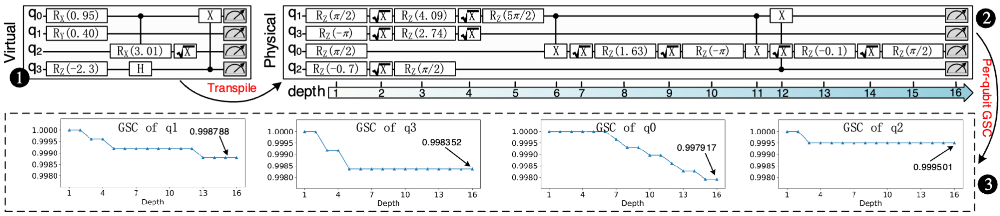

# QuST: Optimizing Quantum Neural Network against Spatial and Temporal Noise Biases

## Introduction

QuST is a noise-resilient QNN model training framework, which can adapt to temporal and spatial noise biases at multiple magnitudes without retraining. We introduce Circuit Sequence Correctness (CSC) as a metric for evaluating circuit reliability in noisy environments. By utilizing CSC as a training weight, we integrate different noise configurations into the QNN model’s loss function, and we employ multi-scale noise-aware training techniques to expand the model’s noise tolerance.

